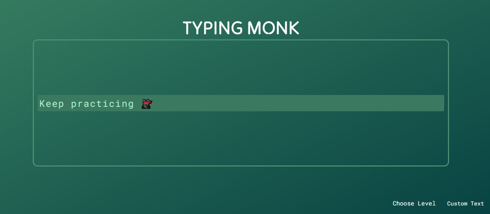
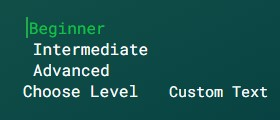
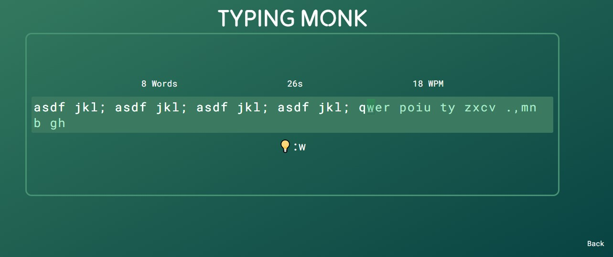
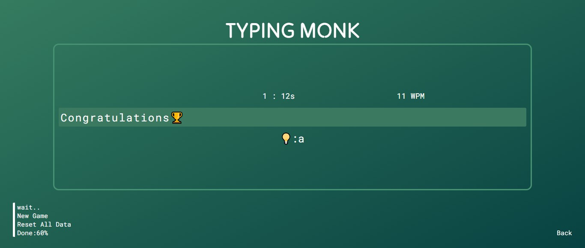

# TYPING MONK v2.0.4

Welcome to Typing Monk v2.04! This version introduces exciting new features and significant improvements to enhance your typing practice. Here's how to get started and what's new:

## Getting Started

- 🔄 **Start Typing**: Begin your session by clicking `Start`.
- 📊 **Choose Level or Custom Text**:
  - 🏆 **Select Level**: Choose your typing difficulty among Beginner, Intermediate, or Advanced.
  - 📩 **Custom Text**: Paste your own text to start your personalized typing journey.
- 💻 **Practice**: Begin practicing your typing skills.

---

## New Features

- 🏆 **Adaptive Typing Complexity**: Choose your typing difficulty based on your skill level (Beginner, Intermediate, Advanced).
- ⏱️ **Completion Time Tracking**: View the time taken to complete each typing session.
- 🚀 **Typing Speed Measurement (WPM)**: Monitor your typing speed in Words Per Minute (WPM).
- 🔙 **Easy Session Revisit**: Use the back button at the bottom right corner to revisit any previous session.

## Enhancements

- 🔧 **Resolved Underflow Issues**: Enjoy a smoother and more reliable typing experience.
- 🐞 **Bug Fixes**: Numerous unexpected errors have been fixed, improving stability and reliability.
- ⚡ **Performance Boost**: Experience faster and more responsive typing sessions.

---

## Screenshots

 
 
 

---

## Created By
- 👨‍💻 Prince-GH
